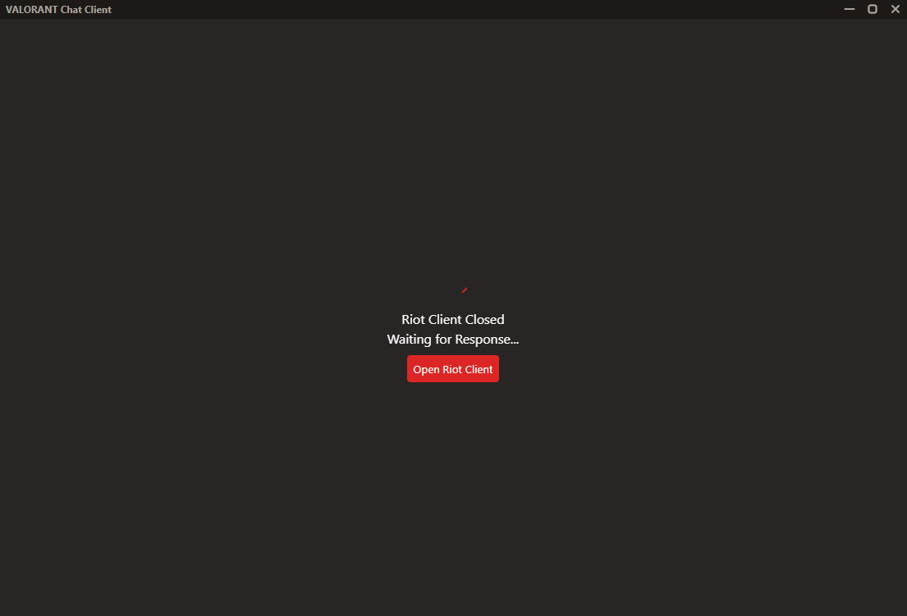
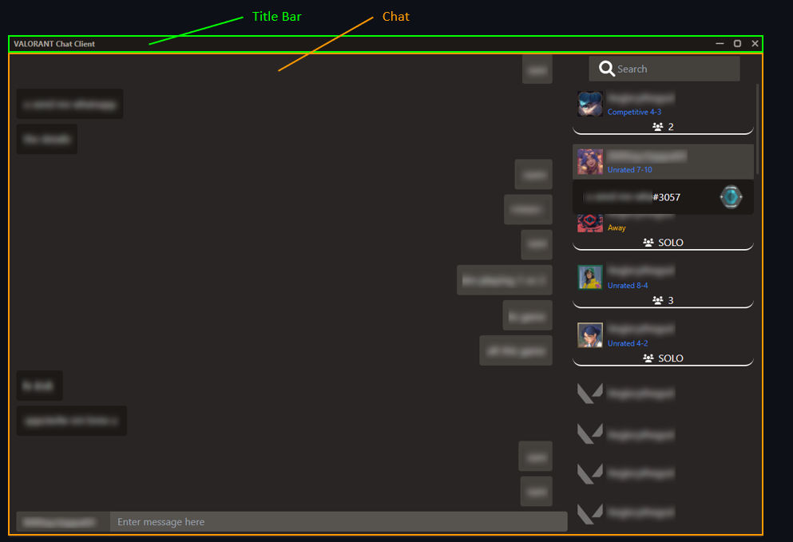
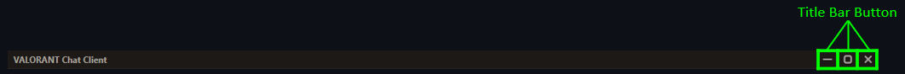
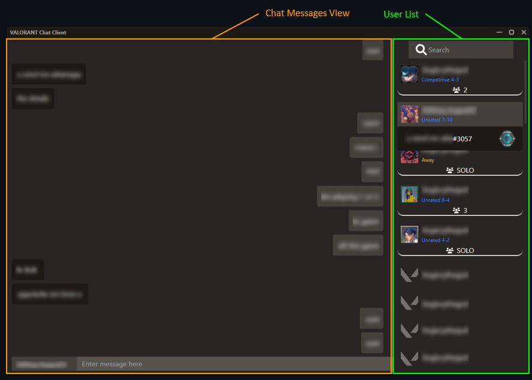
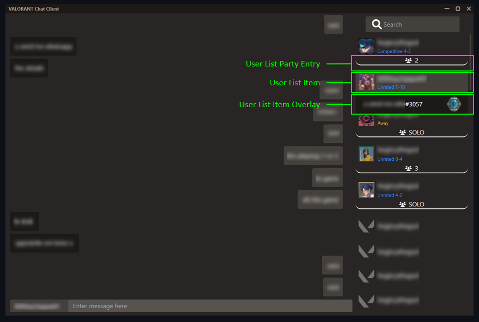

# Contributing
- [Environment Setup](#environment-setup)
- [Project Setup](#project-setup)
- [Project Overview](#project-overview)
- [Folder Structure](#folder-structure)
- [Source Code File Breakdown](#source-code-file-breakdown)
  - [Interfaces](#interfaces)
  - [Preload](#preload)
  - [Main](#main)
  - [Renderer](#renderer)

## Environment Setup
Ensure the following are installed
- Riot Client
- Node.js v16.x

## Project Setup
Fork this repository, clone it, and run
```
yarn install
```

**Running the Application**
```
yarn dev
```

**Building a Production Build**
```
yarn build
```

## Project Overview
VALORANT Chat Client (VCC) uses Electron + Vite + Vue.js. Interfacing with the Riot Client is done using Electron backend code with Axios as the HTTP library. 

Riot Client (runs in the background when VALORANT is opened) hosts a local server which users can also listen to. Both REST and WebSockets are supported. Details on this can be found [here](https://github.com/techchrism/valorant-api-docs/tree/trunk/docs)

## Folder Structure
Level 1:
- [`assets/`](assets/): Images used in VCC
- [`docs/`](docs/): Images used in README.md or this file
- [`packages/`](packages/): Source code (Think of it as the src folder)
- [`public/`](public/): Assets directly copied into VCC root folder
- [`scripts/`](scripts/): Boilerplate scripts to use Vite with Electron and Vue.js taken from [electron-vite-vue](https://github.com/electron-vite/electron-vite-vue)

## Source Code File Breakdown
General explanation of code in [packages/](packages/) folder

### Interfaces
The [`interfaces/`](interfaces/) folder contains a few self-explanatory of class/type definitions except for the [LCU WebSocket](packages/interfaces/LcuWebsocket.ts) class and relevant [LCU WebSocket reply](packages/interfaces/LcuWebsocketReply.ts) interface discussed below. 

For the remaining `ValorantXXX` files, there are 2 types described in each file. The `ValorantRawXXX` interface refers to the exact contents of data sent by the Riot Client API, while `ValorantXXX` is the most minimal form of the interface required for VCC. `ValorantXXX` classes contain a constructor to parse `ValorantRawXXX`.

**LCU WebSockets**
For static data initialization, the Riot Client REST API is used. However, to listen for data updates, such as new messages, WebSockets are used. Messages are formatted similar to [League of Legends' LCU WebSockets](https://hextechdocs.dev/getting-started-with-the-lcu-websocket/). 

### Preload
Contains `vite.config.ts` and the preload script for the renderer process to access the Inter-Process Communication (IPC). 

The IPC serves as a socket connection between Electron's main and renderer process. Read more about Electron's IPC [here](https://www.electronjs.org/docs/latest/tutorial/ipc).

### Main
The [`main/`](main/) folder contains the local backend where connections to VALORANT's backend localhost server take place. Electron docs refer to this part of code as the "main" or "ipcMain" process. The main process is required for communicating with VALORANT's local backend as [CORS](https://developer.mozilla.org/en-US/docs/Web/HTTP/CORS) headers are not sent by the VALORANT local backend.

`index.ts` is the entry point of the application. It contains quite a lot of Electron boilerplate and options settings. It then does the following in order:
1) Automatically start Riot Client using Windows library
2) Read preferences
3) Create main renderer window
4) Create tray icon
5) Initialize internal VCC VALORANT APIs
6) Check for updates and display updater window if necessary


| File           | Description                                                                                                                                                                   |
| -------------- | ----------------------------------------------------------------------------------------------------------------------------------------------------------------------------- |
| Auto Updater   | Simple boilerplate with IPC listeners to activate [Electron Builders's auto update](https://www.electron.build/auto-update.html) upon instructions from the renderer process. |
| Browser Window | Creates both the main renderer window and updater modal window. Uses functions from [preferences](packages/main/preferences.ts) to save window height and position.           |
| Log Util       | Use [electron-log](https://www.npmjs.com/package/electron-log) to save files to log folder                                                                                    |
| Notifications  | Send Windows [notifications using Electron API](https://www.electronjs.org/docs/latest/tutorial/notifications)                                                                |
| Preferences    | Stores and retrieves preferences: Window position and size, whether to minimize application to tray, whether to show notifications                                            |
| Tray           | [Electron Tray API](https://www.electronjs.org/docs/latest/api/tray) boilerplate                                                                                              |
| Valorant       | Interfaces with VALORANT API as described in [valorant-api-docs](https://github.com/techchrism/valorant-api-docs/tree/trunk/docs)                                             |
| Windows        | Use [regedit](https://www.npmjs.com/package/regedit) to search registry for Riot Client launch location and automatically launch Riot Client                                  |


### Renderer
The renderer process uses Vue.js 3 composition API to display the VCC frontend. If you are unfamiliar with Vue.js, refer to the [Vue.js docs](https://vuejs.org/guide/introduction.html).

Technologies used:
- Vue.js
- Vuex
- SASS preprocessor

**src Folder Structure**
| Folder/File | Description                                                                                                                                               |
| ----------- | --------------------------------------------------------------------------------------------------------------------------------------------------------- |
| App.vue     | Global root level CSS properties                                                                                                                          |
| assets/     | Global CSS styles to import                                                                                                                               |
| components/ | Vue components used in VCC frontend                                                                                                                       |
| icons/      | SVG icons in Vue templates                                                                                                                                |
| store/      | Vuex store initialization                                                                                                                                 |
| ts          | Interfaces with valorant-api.com. Note: This is not Riot Games's Valorant API. This is a third-party API by [valorant-api.com](https://valorant-api.com/) |
| updater/    | Updater modal window UI                                                                                                                                   |

#### Components
This components is largely describe in visual pictures.

Note: Some UI components have changed slightly. Below are the changes made
- User List Party Entry highlights entire party and is left aligned (More similar to VALORANT in game list)
- Timestamps added to each message

##### Level 1 Structure
**Error Page**


**Folders**


##### Level 2 Structure
**Title Bar**


**Chat**
`ChatApp`: Handles application state (data taken from Riot Client VALORANT API) and displaying of updater/error windows
`Chat`: Actual chat UI

##### Level 3+ Structure


**User List**
Context Menu


User List Components

