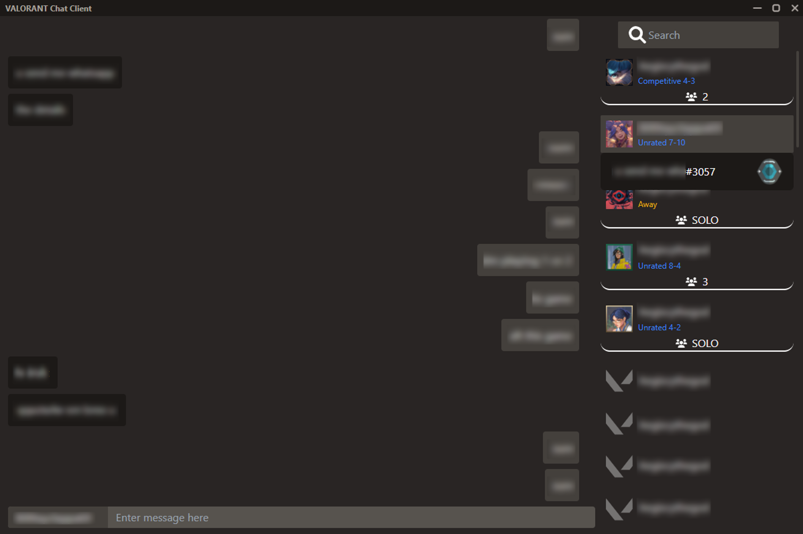
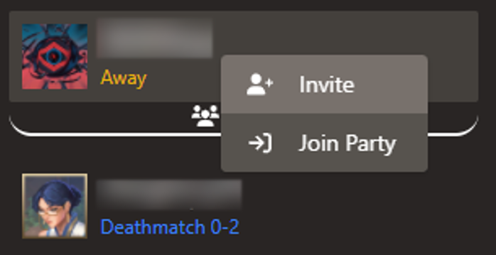
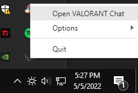
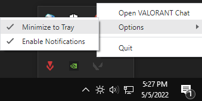
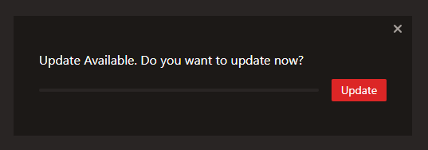

# VALORANT Chat Client

A Windows application to access VALORANT's chat function without opening the game

 

**Rationale**

Many users do not have any access to Riot Mobile and have not way of checking if their friends are already online, much less text them ingame

**Disclaimer**

Use of this application as at OWN RISK. The developer(s) will not be responsible for any harm/damage done due to the use of this application. This application is NOT endorsed by Riot Games.

Nonetheless, you can check out the code. It's pretty much safe. I'm not trying to hack your computer ;)

## Contents
- [VALORANT Chat Client](#valorant-chat-client)
  - [Contents](#contents)
  - [Features](#features)
  - [Installation](#installation)
  - [User Manual](#user-manual)
    - [General Usage](#general-usage)
    - [Tray Icon](#tray-icon)
    - [Updates](#updates)
  - [Contributing](#contributing)

## Features
- Chat with friends in VALORANT with only Riot Client opened
- View current game state of friends
- Invite friends to party / Request to join party / Accept invitation to party (Only when online)

## Installation
1. Download the installer (`VALORANT-Chat-Client-Setup-x.x.x.exe`) under assets from [latest release](https://github.com/jloh02/valorant-chat-client/releases/latest/) 
2. Run the installer on your Windows computer
3. When prompted by Windows Defender, click `More info`, then `Run anyway` (Sorry, I don't wish to pay $100 for a digital certificate) 
4. When prompted to allow the installer to make changes to the computer, click `Yes`
5. Open the VALORANT Chat Client application

## User Manual
### General Usage
- Click on the users on the right side panel to choose who to chat with
- Notifications will appear when anyone sends messages to you (Click on it to return to the application)

- Perform party operations by right-clicking on online players (`Join Party` can be used to accept invites or request to invite)

### Tray Icon
- By default, the application minimizes to the tray icon
- Click on the icon to re-open the application
- Right-clicking the icon opens a menu where you can close the application

- You can change settings (e.g. disable minimizing to tray/notifications) by hovering over `options` in the menu 

### Updates
- When there is a new update, a popup will appear
- Click `Update`, or the cross to ignore the update
- After the update is complete, click the button to quit and install
- When prompted to allow the installer to make changes to the computer, click `Yes`

 

## Contributing
Refer to [CONTRIBUTING.md](CONTRIBUTING.md)
